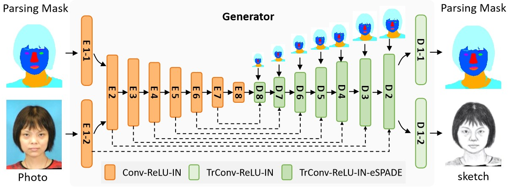
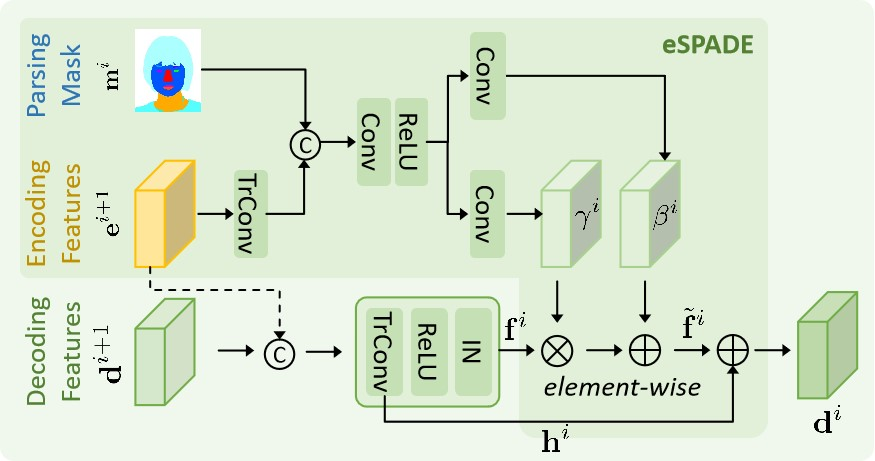
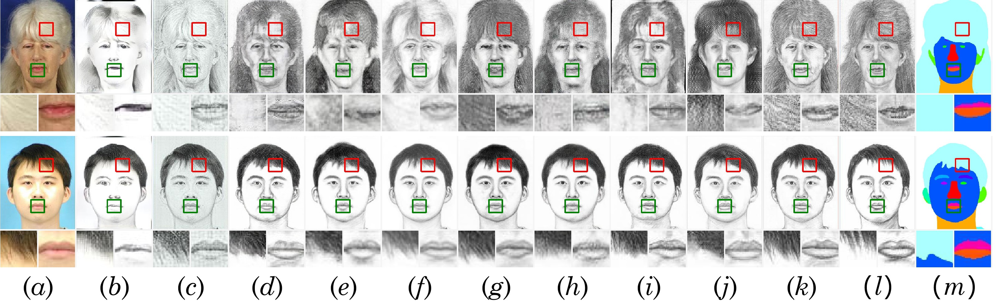
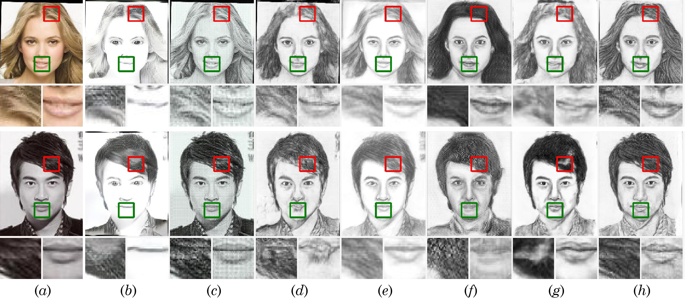
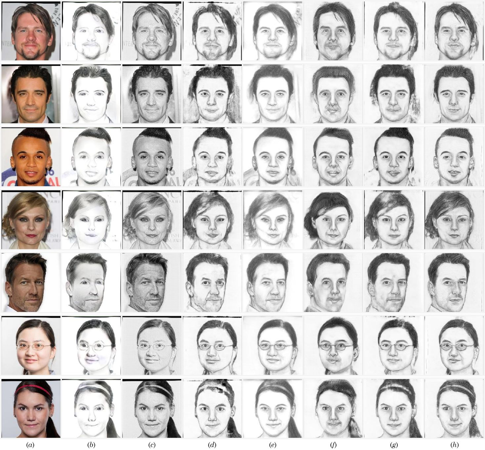

# GENRE

> Face sketch synthesis, GANs, SPADE, image-to-image translation

We provide `PyTorch` implementations for our  ICME2021 paper `GENRE`: 

```latex
@InProceedings{Li2021GENRE,
author = {Xiang Li and Fei Gao and Fei Huang},
title = {High-quality Face Sketch Synthesis via Geometric Normalization and Regularization},
booktitle = {IEEE International Conference on Multimedia and Expo (ICME) 2021},
month = {July 5-9},
year = {2021}
}
```

This project generates artistic portrait drawings (e.g. pencil-drawing) from face photos using a GAN-based model. You may find useful information in preprocessing steps.

## Framework





## Sample Results



Synthesized face sketches on the CUFS dataset: (a) input face photo, (b) FSS-NST, (c) CycleGAN, (d)
Pix2Pix, (e) pGAN, (f) SS-FSS, (g) MDAL, (h) KT-FSS, (i) GauGAN, (j) SCA-GAN, (k) GENRE (ours), (l) target sketch, and (m) parsing mask predicted by BiSeNet.




Synthesised sketches for faces in-the-wild: (a) input photo, (b) FSS-NST, (c) CycleGAN, (d) Pix2Pix, (e) SSL-FSS, (f) GauGAN, (g) SCA-GAN, and (h) GENRE.




Synthesised sketches for faces in the CelebA-HQ dataset: (a) input photo, (b) FSS-NST, (c) CycleGAN, (d) Pix2Pix, (e) SSL-FSS, (f) GauGAN, (g) SCA-GAN, and (h) GENRE.

## Prerequisites

- Linux or macOS
- Python 3.7.3
- Pytorch-lightning 0.7.5
- CPU or NVIDIA GPU + CUDA CuDNN

## Getting Started

### Installation

* Clone this repo: 

  ```
  git clone https://github.com/fei-hdu/genre
  cd genre
  ```

* Install PyTorch 0.4+ and torchvision from [http://pytorch.org](http://pytorch.org/) and other dependencies (e.g., [visdom](https://github.com/facebookresearch/visdom) and [dominate](https://github.com/Knio/dominate)). You can install all the dependencies by

  ```
  pip install -r requirements.txt
  ```

### train/test

* Download our [CUFS dataset]( https://drive.google.com/drive/folders/1A1LABGQKUAN9tYunb8tHjsASLxSL313D?usp=sharing)and copy content to `dataset` folder

* Train a model

  ```
  python train.py --dataset_train_list list_train.txt --dataset_test_list list_test.txt --use_en_feature --use_gmsd --img_w 200 --img_h 250 --input_size 256
  ```

* Test the model

  ```
  python test.py --use_en_feature --img_w 200 --img_h 250 --input_size 256
  ```

* If you want to train on your own data, please first align your pictures and prepare your data's facial parsing according to tutorial in [preprocessing steps](#jump).

* The test results are available at [[Google Drive]](https://drive.google.com/drive/folders/1Y-YUAm_c77tyzAX6HsDIDGcbuLdcDhCb?usp=sharing)

### Apply a pre-trained model

- A face $photo \mapsto sketch$ model pre-trained on [CUHK/CUFS]( https://drive.google.com/drive/folders/1A1LABGQKUAN9tYunb8tHjsASLxSL313D?usp=sharing)
- The [pre-trained model](https://drive.google.com/drive/folders/1lrb-K4_xuMGLYka-G3hAJ1Y3iZefuBcD?usp=sharing) need to be save at `./checkpoint`
- Then you can test the model

### Preprocessing steps

Face photos (and paired drawings) need to be aligned and have facial parsing. And facial parsing after alignment are needed in our code in training. 

In our work,facial parsing is segmented by method in Yu, Changqian, et al. "Bisenet: Bilateral segmentation network for real-time semantic segmentation." *Proceedings of the European conference on computer vision (ECCV)*. 2018.

* First,  we need to align, resize and crop face photos (and corresponding drawings) to 256x256 
* Then,we use code in https://github.com/zllrunning/face-parsing.PyTorch to detect facial parsing for face photos and drawings. 

## Citation

 If you use this code for your research, please cite our paper. 

> Xiang Li, Fei Gao*, and Fei Huang, High-quality Face Sketch Synthesis via Geometric Normalization and Regularization, IEEE International Conference on Multimedia and Expo (ICME) 2021, July 5-9, 2021, Virtual. (Accepted)

**bibtex:**

```latex
@InProceedings{Li2021GENRE,
author = {Xiang Li and Fei Gao and Fei Huang},
title = {High-quality Face Sketch Synthesis via Geometric Normalization and Regularization},
booktitle = {IEEE International Conference on Multimedia and Expo (ICME) 2021},
month = {July 5-9},
year = {2021}
}
```

## Acknowledgments

Our code is inspired by [pytorch-CycleGAN-and-pix2pix](https://github.com/junyanz/pytorch-CycleGAN-and-pix2pix) and [SPADE/GauGAN](https://github.com/NVlabs/SPADE).